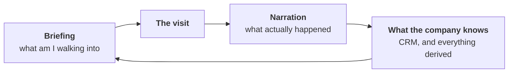
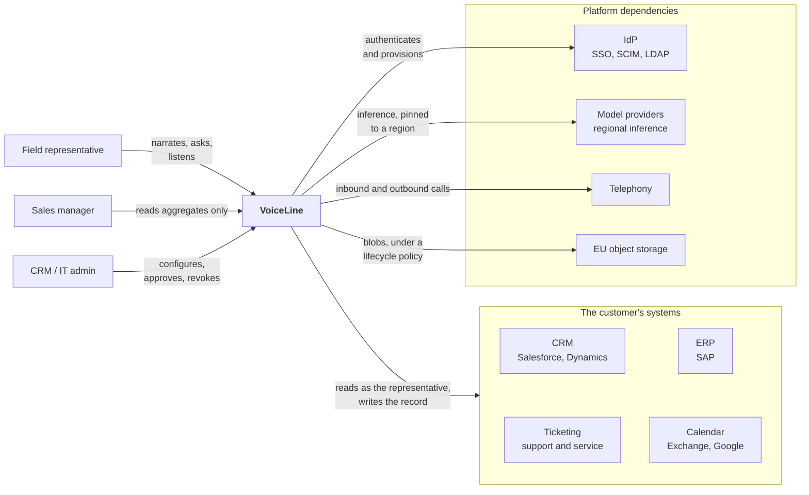
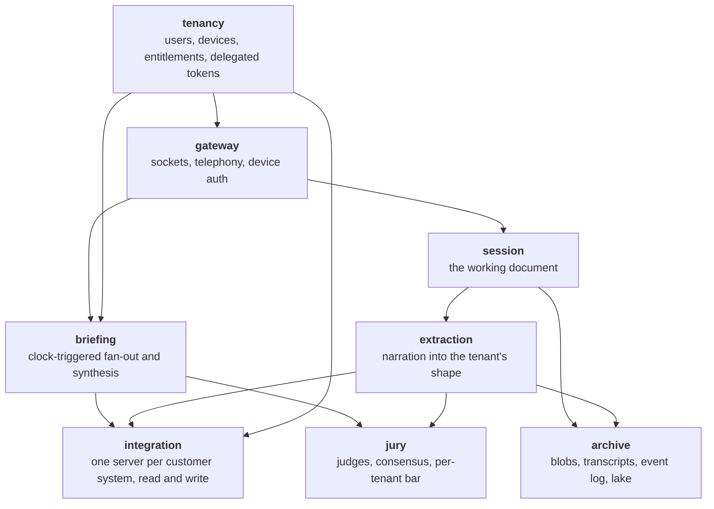
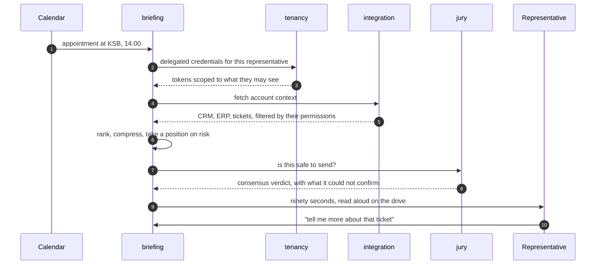
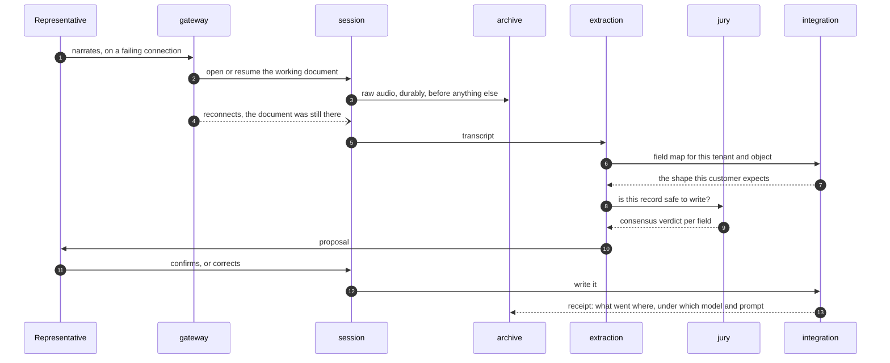

# Building VoiceLine

## §1 Introduction and goals

### 1.1 Requirements overview

**The drive-in:**

- A sales representative drives to a customer appointment and wants to prepare. "Am I walking into an escalation?"
- All kinds of interesting facts could help prepare for the appointment: new support tickets, complaint emails,
  celebrations of completed projects, or praise.
- All of this information exists in the systems of the sales representative's company, but is not easily available,
  especially not during a car drive.

**The drive out:**

- The customer appointment ends, and most of the context is in the sales representative's head.
- By evening, this temporary information was forgotten; the CRM entry is compressed or never written.

**Information Flywheel**

- Fresh information from sales representatives' memories improves the information available in the employer's
  information management systems.
- This additional information improves the preparation for customer communication and appointments.
- Control measures to serve manager reporting needs often involve mandatory fields, adoption scoreboards, and per-rep
  transcripts.
- This increases friction for the sales representative. This additional friction reduces the data quality in the
  employer's systems.

**Complications**:

- **Compress with a point of view:**
  Compressing heaps of data (e.g. three hundred tickets) into a ninety-second preparation report is a complex judgement
  call, not mere information retrieval.
- **Know what the sales rep cannot:**
  Which means reading the customer's own systems.

### 1.2 Quality goals

The hard part is not the transcription itself but these four goals, ranked because they conflict:

1. **Nothing said is lost.** Everything downstream can be recomputed from the recording; the recording cannot be
   recomputed from anything.
2. **Never confidently wrong.** In both directions: a briefing that reports *all fine* during a live escalation, or an
   invented next step in a sales pipeline. Both are worse than staying silent.
3. **Correct per person.** A sales representative sees exactly what they may already see in the customer's systems, and
   nothing more.
4. **Deletable by design.** Personal data decays on a schedule; erasure reaches every copy, including analytical ones.

Goal 1 conflicts with goal 4; §8 describes the resolution.

### 1.3 Stakeholders

| role                                                           | expectations                                                                                                                                                                        |
|----------------------------------------------------------------|-------------------------------------------------------------------------------------------------------------------------------------------------------------------------------------|
| **field representative** (sales, customer success, or service) | a briefing before the visit, hands-free documentation after it, and no surveillance. They are the user and the bottleneck: nothing reaches anyone else except through what they say |
| **sales manager**                                              | a current picture of the territory, served in aggregate rather than directly                                                                                                        |
| **CRM owner**                                                  | control over what is written into their system, and the audit trail to prove it. Not a beneficiary but a potential veto: they bring the security review, SSO, and the works council |

## §2 Architecture constraints

- DACH industrial customers (e.g. ABB, Knauf, DACHSER): procurement processes, works councils, ISO 27001, and data
  residency in Frankfurt.
- The customer's CRM or ERP remains the system of record; VoiceLine never becomes it.
- Narration after a visit, never a recorded meeting: no third party's voice enters the system.
- Thousands of frontline users, tens of thousands of interactions a day.
- A team small enough that every service requiring an on-call rotation is a recurring cost.

## §3 Context and scope

## §4 Solution strategy

- **A session is a working document, not a request.** Live, recorded, or recorded first and transmitted once the signal
  returns: three entry points into one artifact that outlives the network connection. Reconnecting becomes the normal
  case.
- **One integration surface per customer system, read and write.** MCP where the customer can host it, a conventional
  connector where they cannot. The same surface that publishes a visit report also answers questions like *what did we
  quote last time?*
- **Retrieval runs as the person, never as a service account.** This is what makes the briefing safe to ship, and why
  identity is a building block rather than a library.
- **Briefings are precomputed from the calendar.** The appointment is known an hour ahead, so collection and synthesis
  run as scheduled work; the live conversation is a follow-up against an artifact that already exists. Without an
  appointment (e.g. a walk-in, a reshuffled afternoon) the same briefing runs on demand in a reduced form: fewer
  sources, shallower synthesis, and labelled as such.
- **Buy inference, self-host on demand, fine-tune before training.** Provider-hosted by default; self-hosted in
  Frankfurt where procurement requires it.
- **Raw data stays until it must not.** Voice recordings are kept for ninety days, long enough to surface a quality
  problem; after that, the lifecycle in §8 takes over.

## §5 Building block view

### 5.1 Whitebox: the whole system

**Contained building blocks:** each block is separate for its own reason. A name alone is not a reason.

| block           | why it is separate                                                                                                                          |
|-----------------|---------------------------------------------------------------------------------------------------------------------------------------------|
| **gateway**     | must stay available and keep accepting recordings even when everything behind it is broken                                                  |
| **session**     | long-lived and stateful, so it scales with the number of concurrent conversations instead of request volume                                 |
| **briefing**    | batch work on a clock that must never compete with capture for resources                                                                    |
| **extraction**  | its load follows model rate limits, it carries most of the cost per interaction, and it has to be re-runnable over the archive              |
| **integration** | each vendor fails differently, so every connector is deployable and revertible on its own. Some instances run inside the customer's network |
| **tenancy**     | every other block asks it before acting, and it stores the most sensitive credentials                                                       |
| **jury**        | several model calls per verdict give it a different cost and scaling profile than the components it judges                                  |
| **archive**     | retention and erasure are enforced here, and reprocessing reads only from here                                                              |

### 5.2 Important interfaces

One rule: **synchronous when a person is waiting for the answer, a durable job otherwise.**

| edge                               | how                                                       | why                                                                        |
|------------------------------------|-----------------------------------------------------------|----------------------------------------------------------------------------|
| device → gateway                   | HTTPS, resumable, client-minted ULID                      | uploads survive a dying connection, and a retry cannot create a duplicate  |
| device ↔ gateway, live             | WebSocket, bidirectional PCM                              | a live conversation has no file to hand over                               |
| telephony → gateway                | SIP / provider webhook, media bridged to the same session | a phone call is just another entry point into the working document         |
| gateway → session                  | in-process                                                | two halves of one deployment, so no API is needed between them             |
| session → archive                  | write-through, before anything downstream                 | this is quality goal 1                                                     |
| session → extraction               | durable queue, at-least-once, idempotent on recording id  | the representative has already left, so nothing may be lost                |
| calendar → briefing                | scheduled poll or change webhook                          | triggers the precomputation                                                |
| briefing, extraction → integration | gRPC, delegated token per request                         | a typed contract, where the token forms the permission boundary            |
| integration → customer system      | MCP over HTTPS where hosted, else REST / SOAP / OData     | speaks whatever the vendor speaks, within a per-tenant rate budget         |
| briefing, extraction → jury        | in-process fan-out to N model calls                       | verdicts run in parallel, so latency stays at one call instead of N        |
| gateway → device                   | APNs / FCM push                                           | the server announces *briefing ready*, and the phone does not have to poll |
| everything → archive               | append-only event log, one writer                         | the only input the lake ever reads                                         |

**Where durability actually lives:**

- The gateway acknowledges a recording only once the archive holds it; until then, the device is the durable copy, which
  is what the resumable upload and the client-minted ULID are for.
- *Accept when everything behind it is broken* means, in practice: continue accepting bytes, withhold the
  acknowledgement, and let the device hold the recording until the archive recovers.
- Nothing is lost, and the representative can see what is not yet filed.

**Session state lives in Postgres, not in the process:**

- The session process holds the live socket, and nothing that cannot be rebuilt from the database.
- This lets a working document survive a reconnect onto a different instance, and lets a stateful block sit behind the
  availability boundary without becoming one.

## §6 Runtime view

### 6.1 The briefing

- Step 6 is the product.
- Steps 2–3 are why it is not a leak.
- Step 7 is why the representative believes step 9 next time.

### 6.2 The visit report

- Step 3 before step 5 is quality goal 1.
- Step 13 is why the flywheel in §1 turns with data anyone can trust.

## §7 Deployment view

One production region in the EU. Three deployment shapes, because customers buy different degrees of isolation:

- **Shared**: multi-tenant on one cluster, with row-level isolation and per-tenant encryption keys. The default, and
  where the economics work.
- **Single-tenant**: its own namespace, database, and bucket, with customer-managed keys. For customers who pay for it,
  and the answer to a recurring procurement question.
- **In-network integration**: one integration server deployed inside the customer's network, holding their credentials
  and reaching VoiceLine over outbound-only mTLS. This is how SAP behind a corporate firewall is reached without opening
  an inbound port.

Common to all three shapes:

- Flux for GitOps with image automation, SOPS-encrypted secrets, Terraform for the substrate, and encryption at rest
  throughout.
- Model inference pinned per tenant to a region, a provider, or a self-hosted endpoint in Frankfurt.
- The block-to-infrastructure mapping: every block runs in the region except **integration**, the one block that may
  also run inside the customer's network. Single-tenant repeats the whole stack per namespace.

## §8 Crosscutting concepts

### 8.1 Technology choices

- **Mobile**: one cross-platform app in **React Native**, with a native capture core. Capture (background audio,
  CarPlay / Android Auto) is native in either framework, so the choice is reversible and comes down to ecosystem and
  hiring. The core is an encrypted local spool that survives app kill and reboot; nothing leaves it before the server
  acknowledges. Reliable background upload (`URLSession` on iOS, a foreground service on Android) is the hardest
  requirement in the app.
- **Backend**: Go. Inexpensive long-lived connections, straightforward fan-out to slow vendor APIs, and a static binary
  in a distroless image, which is what makes shipping an integration server into a customer's network realistic.
- **State**: Postgres, which also serves as the queue; `SELECT … FOR UPDATE SKIP LOCKED` is sufficient until the fan-out
  justifies operating NATS JetStream as a second system.
- **Blobs**: S3-compatible EU object storage, with retention enforced by the store's lifecycle policy rather than by a
  cleanup job that has to be trusted to have run.
- **Analytics**: materialised views in Postgres first; ClickHouse once that measurably no longer suffices, which happens
  later than expected.
- **Speech recognition**: bought, with custom vocabulary, behind an interface; self-hostable in Frankfurt where
  procurement requires it. Generic recognisers mishandle precisely the article numbers a field report is about.
- **Voice output**: speech synthesis bought like recognition, behind an interface. The briefing's audio is rendered at
  precompute time together with the text, and the live conversation runs on realtime speech models through the same
  per-tenant routing.
- **Extraction and synthesis**: output constrained to a per-tenant JSON Schema, behind a routing layer that can pin a
  tenant to a region or a provider.
- **Infrastructure**: Kubernetes in an EU region, with Flux, SOPS, and Terraform. §7 describes the deployment shapes.
- **Observability**: OpenTelemetry, plus one domain-specific view. Every recording has a lifecycle that a support
  engineer can open, stamped with model and prompt version.

### 8.2 Identity and delegated permissions

- Tenants, users, and devices; SCIM or LDAP provisioning from the customer's directory.
- Every retrieval carries a token scoped to the acting representative in the target system: territory and margin limits
  that exist in SAP still exist when the answer arrives by voice.
- One service account per tenant is how enterprise retrieval typically leaks.

### 8.3 Data lifecycle

A continuum, not a switch; every artifact knows its tier and when it moves:

- Voice recordings expire after roughly ninety days; from then on, the transcript is the deepest tier that
  reprocessing can start from.
- Transcripts outlive them, with third-party names redacted: the customer's plant manager never consented and cannot
  make a request they do not know they could make.
- Transcripts and extractions are **pseudonymised**, which under GDPR is still personal data, so erasure must reach
  them.
- Only the lake holds **anonymised** aggregates, which are outside GDPR, so goals 1 and 4 can both hold.
- The risk sits exactly there: the combination of representative, account, date, and product can be re-identifiable.
  Anonymisation is therefore tested, not declared.
- Deletion walks the tiers; it never has to hunt down copies.

### 8.4 Quality

- A jury of judge models with consensus, rather than a single confidence score.
- Applied in both directions: safe to write, and safe to send.
- The bar is tenant-configurable.
- Where the jury will not sign off, the system states what could not be confirmed rather than softening the claim.

### 8.5 Auditability

- Every briefing traces to the records it read.
- Every write traces to the audio, the transcript, the extraction, and the model and prompt versions behind it.
- This is both the support tool and the evidence a works council asks for.

### 8.6 Tenancy and customisation

- Field maps, feature flags, retention windows, model routing, and jury thresholds are configuration, not branches.
- Onboarding customer 101 must not require a deployment.

### 8.7 Reprocessing

- The archive is the source of truth; everything derived can be rebuilt from it.
- Schema-on-read in the lake, deliberately, until real customers say what they want from a warehouse.
- Improved extraction means re-running yesterday's recordings rather than writing them off.

## §9 Architecture decisions

- Empty until there is a decision to log.
- The format: one dated record per decision, naming the alternatives it rejected.

## §10 Quality requirements

- Empty until real numbers exist; inventing service levels would be fiction.
- The first candidates, named in §1: the share of visits narrated and the time from parking to speaking.

## §11 Risks and technical debt

- **The confidently calm briefing:** the failure mode that ends adoption. The jury is the mitigation, and it is
  unproven.
- **Retrieval leaking across territories:** delegated tokens are correct and slow; the pressure to cache behind a
  service account will be constant.
- **Erasure that does not reach the lake:** anonymisation must hold in practice, not just in this document.
- **MCP into SAP is aspirational:** conventional connectors are the near-term reality; the integration surface must make
  that path routine.
- **Precomputing against a wrong calendar:** wasted computation is cheap; a briefing for the wrong account is not.
- **Silent model drift:** a provider upgrade changes behaviour without any change on VoiceLine's side. Per-tenant
  evaluation sets in CI are the only defence.

## §12 Glossary

| term                 | meaning here                                                                                                                                   |
|----------------------|------------------------------------------------------------------------------------------------------------------------------------------------|
| **anonymised**       | no longer attributable by any means reasonably likely; outside GDPR, and a property to be tested rather than asserted                          |
| **field map**        | one tenant's own schema, read out of their CRM or ERP rather than modelled by VoiceLine                                                        |
| **jury**             | several judge models voting on whether an output is safe to send or write; the bar is tenant configuration                                     |
| **MCP**              | Model Context Protocol: one server per customer system, exposing read and write as tools a model can call                                      |
| **narration**        | a sales representative speaking after a visit; never a recording of the meeting itself, which is why no third party's voice enters the system  |
| **proposal**         | an unconfirmed extraction. It becomes a **record** when the representative accepts it, or when tenant policy promotes that field to unattended |
| **pseudonymised**    | re-identifiable with information held separately; still personal data, still reachable by erasure                                              |
| **session**          | the working document for one interaction, not a login session                                                                                  |
| **working document** | an artifact that outlives the connection carrying it; a dropped connection is a resume rather than a failure                                   |
